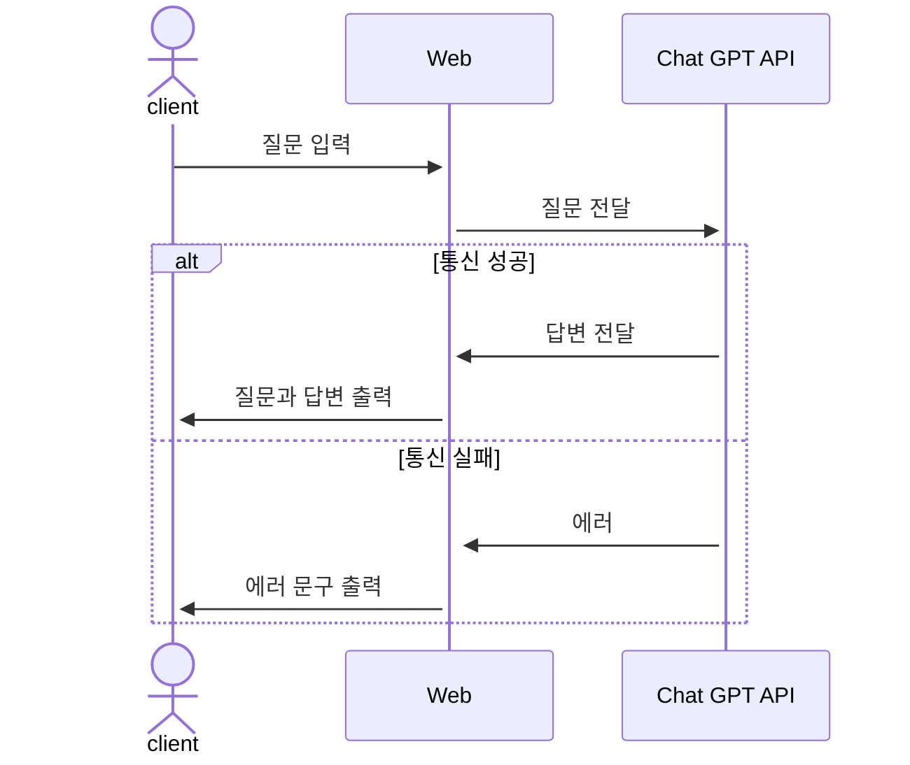
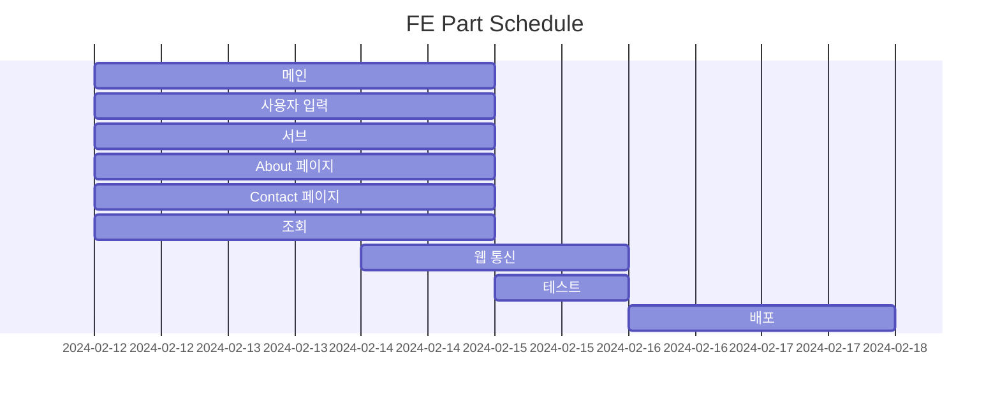

# 중고거래 물품 가격 책정 서비스 
## 1. 목표와 기능 
### 1.1 목표
- 중고 물품 가격 측정시 고민하는 시간 감소
- 빠른 순환 주기로 시장 경제 활성화
- 구매자와 판매자의 만족도 증가

### 1.2 기능
- 구성품 유무, 카테고리, 사용기간, 상태, 구매 가격를 사용자가 입력
- 제출 버튼 클릭 혹은 키보드의 엔터키 입력시 입력 값이 제출
- 사용자의 입력 값을 바탕으로 질문을 생성
- Chat GPT API를 사용해 사용자의 질문과 질문에 대한 답변을 웹상에 출력

### 1.3 추가 기능 
- 로그인
- 회원가입
- 아이디 / 비밀번호 찾기
- 다양한 언어 지원 

### 1.4 팀 구성
- 개인 프로젝트

## 2. 개발 환경 및 배포 URL
### 2.1 개발 환경
- Vanilla JS
- 서비스 배포 환경
  - GitHub Pages

### 2.2 배포 URL
- https://joohyungdev.github.io/product-pricing/
- 테스트용 계정
  ```
  id : admin
  pw : 1q2w3e4r
  ```

### 2.3 URL 구조
- main

| App       | URL                                        | Views Function    | File Name                        | Note           |
|-----------|--------------------------------------------|-------------------|----------------------------------|----------------|
| main      | 'home/'                                    | home              | main/home.js                     | 홈화면 동작     |

- accounts

| App       | URL                                        | Views Function    | File Name                             | Note           |
|-----------|--------------------------------------------|-------------------|---------------------------------------|----------------|
| accounts  | 'sign_up/'                                 | sign up           | accounts/sign_up.html                 |회원가입         |
| accounts  | 'log_in/'                                  | log_in            | accounts/log_in.html                  |로그인           |
| accounts  | 'find_id/'                                 | find_id           | accounts/find_id.html                 |아이디 찾기      |
| accounts  | 'find_pw/'                                 | find_pw           | accounts/find_pw.html                 |비밀번호 찾기    |

- styles

| App       | URL                                        | Views Function    | File Name                        | Note           |
|-----------|--------------------------------------------|-------------------|----------------------------------|----------------|
| styles    | 'reset/'                                  | reset             | styles/reset.css                 | CSS 초기화      |
| styles    | 'style/'                                  | style             | styles/style.css                 | CSS 스타일      |

## 3. 요구사항 명세와 기능 명세 


## 4. 프로젝트 구조와 개발 일정
### 4.1 프로젝트 구조 
```
📦product_pricing
 ┣ 📂accounts
 ┃ ┣ 📜find_id.html
 ┃ ┣ 📜find_pw.html
 ┃ ┣ 📜log_in.html
 ┃ ┗ 📜sign_up.html
 ┣ 📂main
 ┃ ┗ 📜home.js
 ┣ 📂styles
 ┃ ┣ 📜reset.css
 ┃ ┗ 📜style.css
 ┗ 📜home.html
```
### 4.2 개발 일정(WBS)

## 5. 와이어프레임 
