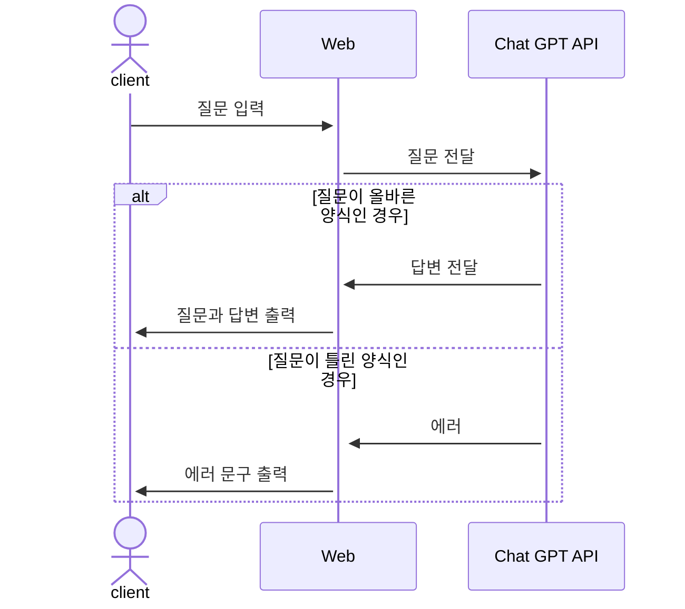

# 중고거래 물품 가격 책정 서비스 
## 1. 목표와 기능 
### 1.1 목표
- 중고 물품 가격 측정시 고민하는 시간 감소
- 빠른 순환 주기로 시장 경제 활성화
- 구매자와 판매자의 만족도 증가

### 1.2 기능
- 카테고리, 사용기간, 상태, 구매 가격, 구성품 유무를 사용자가 입력
- 제출 버튼 클릭 혹은 키보드의 엔터키 입력시 입력 값이 제출
- 사용자의 입력 값을 바탕으로 질문을 생성
- Chat GPT API를 사용해 사용자의 질문과 질문에 대한 답변을 웹상에 출력
- about 버튼을 누르면 웹사이트의 정보 출력
- 로고를 클릭하면 메인 화면으로 이동
- contact 버튼을 누르면 연락 정보 출력
- 돋보기 버튼을 누르면 검색 가능 

### 1.3 팀 구성
- 개인 프로젝트

## 2. 개발 환경 및 배포 URL
### 2.1 개발 환경
- Vanilla JS
- 서비스 배포 환경
  - GitHub Pages

### 2.2 배포 URL
- https://therealparkjoohyung.github.io/product-pricing/

### 2.3 URL 구조

## 3. 요구사항 명세와 기능 명세 

## 4. 프로젝트 구조와 개발 일정
### 4.1 프로젝트 구조 
📦product_pricing
 ┃ ┣ 📂reset.css
 ┃ ┣ 📂__pycache__  
 ┃ ┣ 📜admin.py  
 ┃ ┣ 📜apps.py  
 ┃ ┣ 📜forms.py  
 ┃ ┣ 📜models.py  
 ┃ ┣ 📜tests.py  
 ┃ ┣ 📜urls.py  
 ┃ ┣ 📜views.py  
 ┃ ┗ 📜__init__.py  
