# 중고거래 물품 가격 책정 서비스 
## 1. 목표와 기능 
### 1.1 목표
- 중고 물품 가격 측정시 고민하는 시간 감소
- 빠른 순환 주기로 시장 경제 활성화
- 구매자와 판매자의 만족도 증가

### 1.2 기능
- 구성품 유무, 카테고리, 사용기간, 상태, 구매 가격를 사용자가 입력
- 제출 버튼 클릭 혹은 키보드의 엔터키 입력시 입력 값이 제출
- 사용자의 입력 값을 바탕으로 질문을 생성
- Chat GPT API를 사용해 사용자의 질문과 질문에 대한 답변을 웹상에 출력

### 1.3 추가 기능 
- 로그인
- 회원가입
- 아이디 / 비밀번호 찾기
- 다양한 언어 지원
- 라이트모드 / 다크모드

### 1.4 팀 구성
- 개인 프로젝트

## 2. 개발 환경 및 배포 URL
### 2.1 개발 환경
- Vanilla JS
- 서비스 배포 환경
  - GitHub Pages

### 2.2 배포 URL
- https://joohyungdev.github.io/product-pricing/
- 테스트용 계정
  ```
  id : admin
  pw : 1q2w3e4r
  ```

### 2.3 URL 구조
- main

| App       | URL                                        | Views Function    | File Name                        | Note           |
|-----------|--------------------------------------------|-------------------|----------------------------------|----------------|
| main      | 'home/'                                    | home              | main/home.js                     | 홈화면 동작     |

- accounts

| App       | URL                                        | Views Function    | File Name                             | Note           |
|-----------|--------------------------------------------|-------------------|---------------------------------------|----------------|
| accounts  | 'sign_up/'                                 | sign up           | accounts/sign_up.html                 |회원가입         |
| accounts  | 'log_in/'                                  | log in            | accounts/log_in.html                  |로그인           |
| accounts  | 'find_id/'                                 | find id           | accounts/find_id.html                 |아이디 찾기      |
| accounts  | 'find_pw/'                                 | find password     | accounts/find_pw.html                 |비밀번호 찾기    |

- styles

| App       | URL                                        | Views Function    | File Name                        | Note           |
|-----------|--------------------------------------------|-------------------|----------------------------------|----------------|
| styles    | 'reset/'                                  | reset             | styles/reset.css                 | CSS 초기화      |
| styles    | 'style/'                                  | style             | styles/style.css                 | CSS 스타일      |

### 2.4 ChatGPT 통신

| Action | Method | Data Sent | Response |
|--------|--------|-----------|----------|
| 버튼 클릭 또는 엔터 입력 | POST | 사용자 입력 데이터 | ChatGPT의 응답 |


## 3. 요구사항 명세와 기능 명세 

```mermaid
    sequenceDiagram
    actor A as client
    participant B as Web
    participant C as Chat GPT API
    participant D as Main App
    participant E as Accounts App
    participant F as Styles App

    A->>+B: 홈 화면 로딩
    B->>+D: 'home/' 요청
    D-->>-B: main/home.js 전달
    B-->>-A: 홈 화면 출력

    A->>+B: 회원가입 클릭
    B->>+E: 'sign_up/' 요청
    E-->>-B: accounts/sign_up.html 전달
    B-->>-A: 회원가입 화면 출력

    A->>+B: 로그인 클릭
    B->>+E: 'log_in/' 요청
    E-->>-B: accounts/log_in.html 전달
    B-->>-A: 로그인 화면 출력

    A->>+B: 질문 입력 후 버튼 클릭 또는 엔터 입력
    B->>+C: 질문 전달
    alt 통신 성공
    C->>+B: 답변 전달
    B->>+A: 질문과 답변 출력
    else 통신 실패 
    C->>+B: 에러 메시지 전달
    B->>+A: 에러 문구 출력
    end

    B->>+F: 스타일 요청
    F-->>-B: styles/reset.css, styles/style.css 전달
    B-->>-A: 스타일 적용
```


## 4. 프로젝트 구조와 개발 일정
### 4.1 프로젝트 구조 
```
📦product_pricing
┣ 📂accounts
 ┃ ┣ 📜find_id.html
 ┃ ┣ 📜find_pw.html
 ┃ ┣ 📜log_in.html
 ┃ ┗ 📜sign_up.html
 ┣ 📂main
 ┃ ┗ 📜index.js
 ┣ 📂styles
 ┃ ┣ 📜reset.css
 ┃ ┗ 📜style.css
 ┣ 📜index.html
 ┗ 📜README.md
```
### 4.2 개발 일정(WBS)

```mermaid
gantt
    todayMarker off
dateFormat YYYY-MM-DD

section 홈 화면
'home/' 요청 로직 구현 :2024-02-12, 1d
main/home.js 작성 :2024-02-12, 1d
홈 화면 테스트 :2024-02-12, 1d

section 스타일
styles/reset.css 작성 :2024-02-12, 1d
styles/style.css 작성 :2024-02-12, 1d
스타일 적용 테스트 :2024-02-12, 1d

section 회원가입
'sign_up/' 요청 처리 로직 구현 :2024-02-13, 1d
accounts/sign_up.html 작성 :2024-02-13, 1d
회원가입 화면 테스트 :2024-02-13, 1d

section 로그인
'log_in/' 요청 처리 로직 구현 :2024-02-14, 1d
accounts/log_in.html 작성 :2024-02-14, 1d
로그인 화면 테스트 :2024-02-14, 1d

section 질문-답변
질문 전달 및 응답 처리 로직 구현 :2024-02-15, 1d
에러 처리 로직 구현 :2024-02-15, 1d
질문-답변 기능 테스트 :2024-02-15, 1d

section 테스트
전체 시스템 통합 테스트 :2024-02-15, 1d

section 배포
배포 준비 :2024-02-16, 1d
시스템 배포 :2024-02-16, 1d
```

## 5. 와이어프레임 / UI
### 5.1 와이어프레임


### 5.2 화면 설계
<table>
    <tbody>
        <tr>
            <td>메인</td>
            <td>다크모드</td>
        </tr>
        <tr>
            <td>
		
            </td>
            <td>
                
            </td>
        </tr>
        <tr>
            <td>계산하기</td>
            <td>계산하기(영문)</td>
        </tr>
        <tr>
            <td>
                
            </td>
            <td>
                
            </td>
        </tr>
        <tr>
            <td>로그인</td>
            <td>회원가입</td>
        </tr>
        <tr>
            <td>
                
            </td>
            <td>
                
            </td>
        </tr>
        <tr>
            <td>아이디 찾기</td>
            <td>비밀번호 찾기</td>
        </tr>
        <tr>
            <td>
	        
            </td>
            <td>
                
            </td>
        </tr>
    </tbody>
</table>


