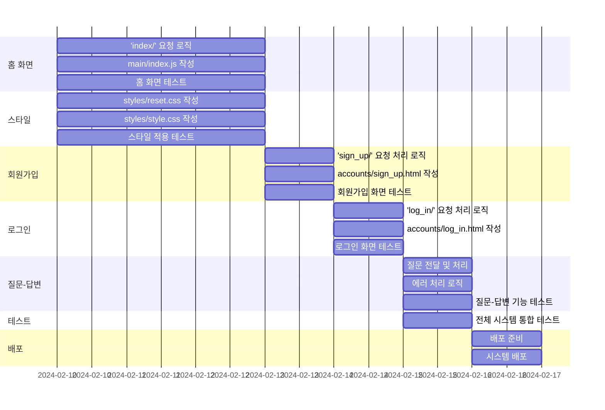

# 중고거래 물품 가격 책정 서비스 
## 1. 목표와 기능 
### 1.1 목표
- 중고 물품 가격 측정시 고민하는 시간을 감소
- 빠른 순환 주기로 시장 경제 활성화
- 구매자와 판매자의 만족도 증가

### 1.2 주요 기능
- 구성품 유무, 카테고리, 사용기간, 상태, 구매 가격를 사용자가 입력
- 제출 버튼 클릭 혹은 키보드의 엔터키 입력시 입력 값이 제출
- 사용자의 입력 값을 바탕으로 질문을 생성
- Chat GPT API를 사용해 사용자의 질문과 질문에 대한 답변을 웹상에 출력

### 1.3 추가 기능 
- 로그인
- 회원가입
- 아이디 / 비밀번호 찾기
- 한국어 / 영어 지원
- 라이트모드 / 다크모드

### 1.4 팀 구성
- 개인 프로젝트

## 2. 개발 환경 및 배포 URL
### 2.1 개발 환경
- Vanilla JS
- 서비스 배포 환경
  - GitHub Pages

### 2.2 배포 URL
- https://joohyungdev.github.io/product-pricing/
- 테스트용 계정
  ```
  id : admin
  pw : 1q2w3e4r
  ```

### 2.3 URL 구조
- main

| App       | URL                                        | Views Function    | File Name                        | Note           |
|-----------|--------------------------------------------|-------------------|----------------------------------|----------------|
| main      | 'index/'                                    | index             | main/index.js                    | 홈화면 동작     |

- accounts

| App       | URL                                        | Views Function    | File Name                             | Note           |
|-----------|--------------------------------------------|-------------------|---------------------------------------|----------------|
| accounts  | 'sign_up/'                                 | sign up           | accounts/sign_up.html                 |회원가입         |
| accounts  | 'log_in/'                                  | log in            | accounts/log_in.html                  |로그인           |
| accounts  | 'find_id/'                                 | find id           | accounts/find_id.html                 |아이디 찾기      |
| accounts  | 'find_pw/'                                 | find password     | accounts/find_pw.html                 |비밀번호 찾기    |
| accounts  | 'font/'                                    | font              | font.css                              |폰트            |

- styles

| App       | URL                                        | Views Function    | File Name                        | Note           |
|-----------|--------------------------------------------|-------------------|----------------------------------|----------------|
| styles    | 'reset/'                                  | reset             | styles/reset.css                 | CSS 초기화      |
| styles    | 'style/'                                  | style             | styles/style.css                 | CSS 스타일      |

### 2.4 ChatGPT 통신

| Action | Method | Data Sent | Response |
|--------|--------|-----------|----------|
| 버튼 클릭 또는 엔터 입력 | POST | 사용자 입력 데이터 | ChatGPT의 응답 |


## 3. 요구사항 명세와 기능 명세 


## 4. 프로젝트 구조와 개발 일정
### 4.1 프로젝트 구조 
```
📦product_pricing
 ┣ 📂accounts
 ┃ ┣ 📜find_id.html
 ┃ ┣ 📜find_pw.html
 ┃ ┣ 📜font.css
 ┃ ┣ 📜log_in.html
 ┃ ┗ 📜sign_up.html
 ┣ 📂main
 ┃ ┗ 📜index.js
 ┣ 📂samples
 ┃ ┣ 📜change_lang.png
 ┃ ┣ 📜dark_mode.png
 ┃ ┣ 📜eng_calc.png
 ┃ ┣ 📜find_id.png
 ┃ ┣ 📜find_pw.png
 ┃ ┣ 📜kor_calc.png
 ┃ ┣ 📜light_mode.png
 ┃ ┣ 📜log_in.png
 ┃ ┗ 📜sign_up.png
 ┣ 📂styles
 ┃ ┣ 📜reset.css
 ┃ ┗ 📜style.css
 ┣ 📜index.html
 ┗ 📜README.md
```
### 4.2 개발 일정(WBS)

## 5. 와이어프레임 / UI
### 5.1 와이어프레임


### 5.2 화면 설계
<table>
    <tbody>
        <tr>
            <td>메인</td>
            <td>다크모드</td>
        </tr>
        <tr>
            <td>
		
            </td>
            <td>
                
            </td>
        </tr>
        <tr>
            <td>계산하기</td>
            <td>계산하기(영문)</td>
        </tr>
        <tr>
            <td>
                
            </td>
            <td>
                
            </td>
        </tr>
        <tr>
            <td>로그인</td>
            <td>회원가입</td>
        </tr>
        <tr>
            <td>
                
            </td>
            <td>
                
            </td>
        </tr>
        <tr>
            <td>아이디 찾기</td>
            <td>비밀번호 찾기</td>
        </tr>
        <tr>
            <td>
	        
            </td>
            <td>
                
            </td>
        </tr>
    </tbody>
</table>

## 6. 에러와 에러 해결
### 1. 사용자의 입력을 받는 부분에서 라디오 버튼의 값(value)를 JS 파일에서 받아오지 못하였음
- 라디오 버튼의 입력값을 `.value`로 받는 것이 아닌, 라디오 버튼의 쿼리를 순회를 돌며 `.defaultValue`를 사용하여 받아올 수 있었습니다.
### 2. ChatGPT에게 API를 요청하는 함수의 작동 오류
- 처음에는 버튼 이벤트 리스너 함수 안에 API 요청 함수를 넣었으나 정상적으로 작동하지 않았습니다. 이를 이벤트 리스너 함수 밖으로 빼서 해결하였습니다.
### 3. console.log 자주 찍어보기
- 생각하는 대로 잘 동작하는지 확인하기 위해 `console.log`를 자주 찍어보며 진행을 하였습니다. 이러한 습관 덕분에 오류를 금방 해결할 수 있었던 것 같습니다. 

## 7. 개발하며 느낀점
어렵지만 관심있는 주제로 프로젝트를 한다는 것 자체가 재미있는 경험이었습니다. 다만, 추가하면 좋겠다고 생각했던 부분이 있었습니다. 

### 1. 데이터 베이스 추가 
- 데이터베이스에 사용자의 입력 값을 저장한다음 추후에 다시 검색하지 않고도 비슷한 물건을 바로 확인 가능하게끔 구현하면 좋을 것 같다고 생각했습니다.
### 2. 백엔드 부분 추가 
- 지금은 언어 번역 기능을 JS파일에 직접 입력하여 작성하였지만 백엔드 부분을 추가하여 그 백엔드 부분에서 언어 번역 기능을 구현하면 좋을 것 같다고 생각했습니다.
### 3. API 추가
- 중고마켓의 API로 홈 화면에 인기있는 카테고리의 정보를 좌 / 우측에 띄우면 좋을 것 같다고 생각했습니다.
### 4. 사용자 경험 개선
- 계산 결과를 기다리는 동안 모래시계 그림 혹은 텍스트를 설정하여 입력을 잘 받았으며 계산중이라는 것을 알려주어 사용자 경험을 개선할 수 있을 것이라고 생각했습니다.


